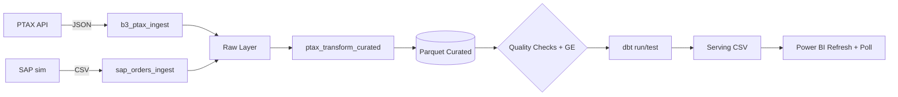

## 🏷️ Badges


## ✨ Visão Geral

Projeto **Airflow (produção-ready)** com:
- Estrutura modular (ingestion/transform/serving) + **plugins** e **include**
- **CI/CD** (lint, testes, DagBag, build & push GHCR)
- **Kubernetes** via Helm (KubernetesExecutor) + renderer de `values`
- **Qualidade de dados** (checks + GE-like), **alertas Slack**, **dbt** (DuckDB)
- **Power BI refresh** (API + polling) e **Secrets Backend** (Azure Key Vault)


## 🧱 Arquitetura (Mermaid)



## 📁 Estrutura
```
dags/               # DAGs por domínio e utilitários
plugins/            # Operators/Hooks/Sensors/Macros customizados
include/            # Raw/Curated/Serving/Quality assets
configs/            # variables.json / pools.json / connections.sample.json
env/                # .env exemplos e templates
ops/                # docker, helm, compose e ferramentas
ci/                 # pipelines GitHub Actions
tests/              # unit e integration
dbt/                # projeto dbt (DuckDB)
docs/               # guias e tutoriais
```


## 🚀 Quickstart (dev local)
```bash
docker compose -f ops/compose/docker-compose.yml up -d airflow-init
docker compose -f ops/compose/docker-compose.yml up -d
# http://localhost:8080 (admin/admin)
```

# Airflow Project – Production Skeleton

Estrutura base para times com CI/CD e deploy em Kubernetes.

## Pastas principais
- `dags/`: DAGs por domínio (ingestion/transform/serving).
- `include/`: SQL, templates Jinja, schemas.
- `plugins/`: Operators, Hooks, Sensors, Macros reutilizáveis.
- `configs/`: variables/pools/connections (amostras – sem segredos).
- `env/`: arquivos `.env` de exemplo (NÃO commitar segredos reais).
- `ops/`: Docker, Helm (K8s) e Compose (dev local).
- `ci/`: pipelines e checks de qualidade.
- `tests/`: testes unitários e de integração (DagBag, operators, e2e).
- `dbt/` (opcional): projeto dbt acoplado/orquestrado pelo Airflow.

## Dev rápido (docker-compose)
```bash
cp env/airflow.env.sample .env
docker compose -f ops/compose/docker-compose.yml up -d
```

## Import de variáveis/pools
```bash
airflow variables import configs/variables.json
airflow pools import configs/pools.json
```

> Connections devem ser criadas via UI/CLI/Secrets Backend (ver `configs/connections.sample.json`).

## 🚀 Quick start (dev local com Docker)
```bash
# na raiz do projeto
cp env/airflow.env.sample env/airflow.env.backup  # opcional
# .env já está pronto na raiz; ajuste se quiser.

# subir serviços (inicia banco, migra e cria usuário admin/admin)
docker compose -f ops/compose/docker-compose.yml up -d airflow-init
docker compose -f ops/compose/docker-compose.yml up -d

# acessar UI do Airflow
# http://localhost:8080 (user: admin / pass: admin)
```

## ✅ GitHub Actions
O pipeline valida formatação, executa testes e checa o DagBag a cada push/PR em `main`.

## 🔧 Personalização
- Buckets: edite `RAW_BUCKET` e `CURATED_BUCKET` no `.env`.
- Executor: ajuste `AIRFLOW__CORE__EXECUTOR` no `.env` (por padrão `LocalExecutor`).
- Slack: preencha `SLACK_WEBHOOK_URL` (se usar alertas).


## 🧩 dbt (DuckDB)
Rodar no container:
```bash
docker compose -f ops/compose/docker-compose.yml exec webserver   bash -lc "cd /opt/airflow/dbt && dbt run --profiles-dir profiles && dbt test --profiles-dir profiles"
```

## 🐳 Build & Push da imagem (GHCR)
O workflow `ci` já realiza build e push para `ghcr.io/<USER>/<REPO>:latest` em pushes na `main`.
Certifique-se que o repositório tem **Actions habilitado** e permissões de **packages: write**.

## ☸️ Deploy K8s (Helm)
Edite `ops/helm/values-prod.yaml` substituindo `Paulobenicpv/Airflow` por `seu_user/seu_repo` e aplique:
```bash
helm upgrade --install airflow apache-airflow/airflow -f ops/helm/values-prod.yaml -n data-platform
```


## 🔐 Secrets Backend (templates)
Exemplos para ativar secrets por ambiente (ajuste no Helm ou `.env`):

### AWS SSM / Secrets Manager
```
AIRFLOW__SECRETS__BACKEND=airflow.providers.amazon.aws.secrets.systems_manager.SystemsManagerParameterStoreBackend
AIRFLOW__SECRETS__BACKEND_KWARGS={"connections_prefix":"/airflow/connections","variables_prefix":"/airflow/variables","region_name":"us-east-1"}
```

### GCP Secret Manager
```
AIRFLOW__SECRETS__BACKEND=airflow.providers.google.cloud.secrets.secret_manager.CloudSecretManagerBackend
AIRFLOW__SECRETS__BACKEND_KWARGS={"connections_prefix":"airflow-connections","variables_prefix":"airflow-variables","project_id":"SEU_PROJECT_ID"}
```

### Azure Key Vault
```
AIRFLOW__SECRETS__BACKEND=airflow.providers.microsoft.azure.secrets.key_vault.AzureKeyVaultBackend
AIRFLOW__SECRETS__BACKEND_KWARGS={"vault_url":"https://SEU_VAULT.vault.azure.net/"}
```


## 🔐 Azure Key Vault – Secrets Backend (prod)
1) Crie um **Key Vault** e um **Service Principal** com permissão `secrets/get,set,list`.
2) Forneça as credenciais ao runtime do Airflow (K8s Secret/Workload Identity):
   - `AZURE_CLIENT_ID`, `AZURE_TENANT_ID`, `AZURE_CLIENT_SECRET`
3) Ajuste `ops/helm/values-prod.yaml`:
```yaml
extraEnv:
  - name: AIRFLOW__SECRETS__BACKEND
    value: airflow.providers.microsoft.azure.secrets.key_vault.AzureKeyVaultBackend
  - name: AIRFLOW__SECRETS__BACKEND_KWARGS
    value: '{"connections_path":"airflow-connections","variables_path":"airflow-variables","vault_url":"https://SEU_VAULT.vault.azure.net/"}'
```
4) Convention de nomes:
   - **Connections:** `airflow-connections/<CONN_ID>` (JSON do connection)
   - **Variables:** `airflow-variables/<VAR_KEY>` (valor em texto)
5) Teste no pod:
```bash
airflow connections get <conn_id>
airflow variables get <var_key>
```


## ☸️ Deploy Rápido (Helm + Renderer)
1) Faça login no GHCR e assegure que a imagem foi publicada pelo CI (`:latest` e `:<short_sha>`).
2) Gere `values-prod.yaml` a partir do template:
```bash
export NAMESPACE=airflow-prod
export IMAGE_REPO=ghcr.io/Paulobenicpv/Airflow
export IMAGE_TAG=latest
export VAULT_URL=https://SEU_VAULT.vault.azure.net/
python ops/tools/render_values.py
```
3) Crie o Secret com credenciais do Azure (exemplo):
```bash
kubectl -n $NAMESPACE create secret generic airflow-azure   --from-literal=AZURE_CLIENT_ID='xxxx'   --from-literal=AZURE_TENANT_ID='xxxx'   --from-literal=AZURE_CLIENT_SECRET='xxxx'
```
4) Instale/atualize via Helm:
```bash
helm repo add apache-airflow https://airflow.apache.org
helm repo update
helm upgrade --install airflow apache-airflow/airflow -n $NAMESPACE -f ops/helm/values-prod.yaml
```
